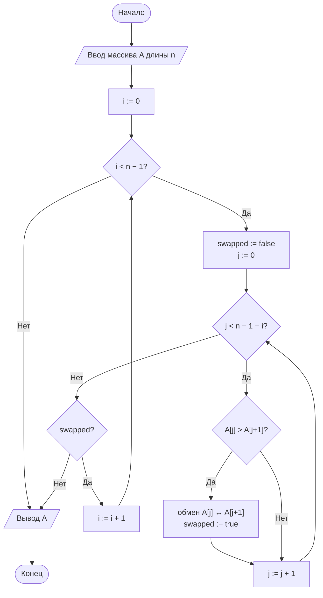
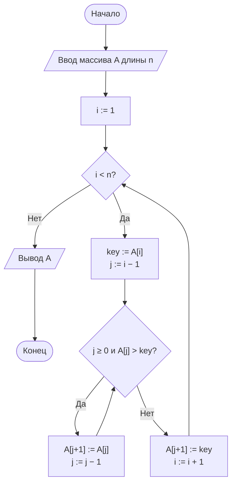

# Лабораторная работа № 2

## Эмпирический анализ временной сложности алгоритмов сортировки. Часть 1: квадратичные алгоритмы (сортировка обменом и сортировка вставками)

**Дисциплина:** Теория алгоритмов
**Направление подготовки:** 38.03.05 «Бизнес-информатика»
**Курс:** 2
**Объём:** 4 академических часа
**Язык реализации:** Python 3.10+ (библиотеки `time`, `random`, `statistics`, `matplotlib`)

---

## 1. Цель и задачи работы

**Цель работы:** освоить методику экспериментального исследования временной сложности алгоритмов и сопоставить полученные эмпирические зависимости с теоретическими асимптотическими оценками на примере простых алгоритмов сортировки.

**Задачи:**

1. Изучить понятия вычислительной сложности, асимптотических обозначений $O$, $\Omega$, $\Theta$, а также лучшего, среднего и худшего случаев.
2. Реализовать сортировку обменом («пузырьком») и сортировку вставками.
3. Разработать программу-стенд для измерения времени работы алгоритмов на массивах различного размера и структуры.
4. Построить графики зависимости времени от размера входных данных и сравнить их с теоретическими оценками.
5. Сформулировать выводы о применимости алгоритмов.

---

## 2. Теоретическая часть

### 2.1. Задача сортировки

Пусть задана последовательность из $n$ элементов $A = \langle a_1, a_2, \ldots, a_n \rangle$, на множестве значений которых определено отношение порядка $\le$. *Задача сортировки* состоит в нахождении такой перестановки $\langle a'_1, a'_2, \ldots, a'_n \rangle$ исходной последовательности, для которой выполняется условие [1]

$$a'_1 \le a'_2 \le \ldots \le a'_n.$$

Сортировка — одна из наиболее часто решаемых задач в информационных системах предприятия. Она применяется при ранжировании клиентов по выручке, упорядочении транзакций по времени, подготовке данных для бинарного поиска, построении отчётов и т. д.

**Основные характеристики алгоритмов сортировки:**

| Характеристика | Содержание |
|---|---|
| Временная сложность | Зависимость числа элементарных операций (сравнений, перестановок) от $n$ |
| Пространственная сложность | Объём дополнительной памяти |
| Устойчивость (стабильность) | Сохранение взаимного порядка элементов с равными ключами |
| Адаптивность | Ускорение работы на частично упорядоченных данных |
| Сортировка «на месте» (in-place) | Использование $O(1)$ дополнительной памяти |

### 2.2. Асимптотический анализ

Трудоёмкость алгоритма описывается функцией $T(n)$ — числом элементарных операций при входе размера $n$. Для сравнения алгоритмов используются асимптотические обозначения [1, 2]:

- $T(n) = O(g(n))$ — существуют $c > 0$ и $n_0$, такие что $T(n) \le c \cdot g(n)$ при всех $n \ge n_0$ (оценка сверху);
- $T(n) = \Omega(g(n))$ — $T(n) \ge c \cdot g(n)$ при $n \ge n_0$ (оценка снизу);
- $T(n) = \Theta(g(n))$ — одновременно $O$ и $\Omega$ (точная оценка).

Для квадратичного алгоритма $T(n) = \Theta(n^2)$. Отсюда следует практическое правило: **при увеличении $n$ в 2 раза время работы возрастает примерно в 4 раза.** Именно это соотношение проверяется экспериментально в данной работе.

### 2.3. Сортировка обменом («пузырьком», Bubble Sort)

**Идея.** Массив многократно просматривается слева направо, соседние элементы сравниваются и при нарушении порядка меняются местами. После $i$-го прохода $i$ наибольших элементов занимают окончательные позиции в конце массива («всплывают»).

**Оптимизация с флагом.** Если за проход не выполнено ни одного обмена, массив упорядочен и работу можно завершить досрочно. Эта модификация делает алгоритм адаптивным: на упорядоченном массиве достаточно одного прохода.

**Псевдокод:**

```
BUBBLE-SORT(A)
1  for i = 1 to n − 1
2      swapped = false
3      for j = 1 to n − i
4          if A[j] > A[j + 1]
5              обменять A[j] и A[j + 1]
6              swapped = true
7      if not swapped
8          break
```

### 2.4. Сортировка вставками (Insertion Sort)

**Идея.** Массив условно делится на отсортированную (левую) и неотсортированную (правую) части. На каждом шаге первый элемент неотсортированной части (*ключ*) вставляется в нужную позицию отсортированной части. Для этого бóльшие элементы сдвигаются на одну позицию вправо. Так раскладывают игральные карты в руке [1].

**Псевдокод:**

```
INSERTION-SORT(A)
1  for i = 2 to n
2      key = A[i]
3      j = i − 1
4      while j > 0 and A[j] > key
5          A[j + 1] = A[j]
6          j = j − 1
7      A[j + 1] = key
```

Число сдвигов в сортировке вставками равно числу **инверсий** в массиве, то есть пар $(i, j)$, где $i < j$ и $A[i] > A[j]$. Поэтому на почти упорядоченных данных алгоритм работает практически за линейное время. По этой причине сортировка вставками используется как составная часть гибридных алгоритмов (Timsort, introsort) для коротких подмассивов [3, 4].

### 2.5. Сравнительная характеристика

**Таблица 1. Теоретические оценки**

| Алгоритм | Лучший случай | Средний случай | Худший случай | Доп. память | Устойчивость |
|---|---|---|---|---|---|
| Пузырьком (с флагом) | $\Theta(n)$ | $\Theta(n^2)$ | $\Theta(n^2)$ | $O(1)$ | Да |
| Вставками | $\Theta(n)$ | $\Theta(n^2)$ | $\Theta(n^2)$ | $O(1)$ | Да |

Хотя асимптотика совпадает, на случайных данных сортировка вставками выполняет в среднем примерно вдвое меньше сравнений ($\approx n^2/4$ против $\approx n^2/2$). К тому же сдвиг элемента дешевле обмена. Поэтому на практике она заметно быстрее.

### 2.6. Методика измерения времени

При экспериментальном исследовании необходимо соблюдать следующие правила [4, 5]:

1. **Использовать монотонный таймер высокого разрешения.** В Python это `time.perf_counter()`. Функция `time.time()` для этих целей непригодна: она зависит от системных часов и имеет низкое разрешение.
2. **Подавать всем алгоритмам одинаковые данные.** Входной массив генерируется один раз с фиксированным зерном генератора (`seed`), а каждый алгоритм работает с его копией.
3. **Повторять измерения.** Каждый замер выполняется $k$ раз ($k \ge 3$), в качестве результата берётся **медиана**: она устойчива к случайным выбросам, вызванным фоновыми процессами ОС.
4. **Проверять корректность.** Результат сортировки сравнивается с эталоном (`sorted()`), иначе измеряется время работы ошибочной программы.
5. **Исключать из замера посторонние операции:** генерацию данных, вывод на экран, построение графиков.
6. **Фиксировать условия эксперимента:** процессор, объём ОЗУ, версию интерпретатора.

Для проверки квадратичного характера зависимости удобно вычислять отношение $T(n)/n^2$. Для квадратичного алгоритма оно должно быть приблизительно постоянным.

---

## 3. Порядок выполнения работы

1. Изучить теоретическую часть.
2. Построить блок-схемы обоих алгоритмов.
3. Реализовать алгоритмы сортировки в виде функций, **не изменяющих** исходный массив (функция возвращает новый отсортированный список).
4. Реализовать функцию генерации данных согласно варианту (табл. 2, 3) и функцию замера времени.
5. Провести эксперимент для всех размеров массивов из своего варианта.
6. Построить график $T(n)$ для двух алгоритмов на одних осях.
7. Выполнить дополнительное задание варианта.
8. Сравнить экспериментальные результаты с теоретическими оценками и оформить отчёт.

---

## 4. Варианты заданий

**Таблица 2. Типы входных данных**

| Код | Тип данных | Способ получения |
|---|---|---|
| R | Случайные | Равномерно распределённые целые числа из диапазона |
| S | Упорядоченные | Случайный массив, отсортированный по возрастанию |
| V | Обратно упорядоченные | Случайный массив, отсортированный по убыванию |
| N | Почти упорядоченные | Упорядоченный массив, в котором выполнено $n/20$ случайных перестановок пар ($\approx 5\%$) |
| D | С большим числом повторов | Случайные числа из узкого диапазона [0; 10] |

**Таблица 3. Исходные данные**

| № | Размеры массива $n$ | Тип данных | Диапазон значений | Повторов $k$ | Дополнительное задание |
|---|---|---|---|---|---|
| 0 | 500, 1000, 2000, 3000, 4000, 5000 | R | [0; 100 000] | 3 | — |
| 1 | 500, 1000, 1500, 2000, 2500, 3000 | R | [0; 1000] | 3 | М1 |
| 2 | 1000, 2000, 3000, 4000, 5000 | V | [−1000; 1000] | 3 | М2 |
| 3 | 1000, 2000, 4000, 8000 | N | [0; 10 000] | 5 | М3 |
| 4 | 200, 400, 800, 1600, 3200 | R | [−500; 500] | 5 | М4 |
| 5 | 1000, 2000, 3000, 4000, 5000, 6000 | S | [0; 100 000] | 3 | М5 |
| 6 | 500, 1000, 2000, 4000 | D | [0; 10] | 5 | М1 |
| 7 | 1000, 1500, 2000, 2500, 3000 | R | вещественные [0; 1) | 3 | М6 |
| 8 | 500, 1000, 1500, 2000, 2500 | V | [0; 50 000] | 5 | М3 |
| 9 | 2000, 4000, 6000, 8000 | N | [0; 1 000 000] | 3 | М2 |
| 10 | 300, 600, 900, 1200, 1500, 1800 | R | [0; 100] | 7 | М4 |
| 11 | 1000, 2000, 3000, 4000 | D | [0; 10] | 3 | М5 |
| 12 | 500, 1000, 2000, 3000, 4000 | R | [−10 000; 10 000] | 5 | М7 |
| 13 | 1000, 2000, 3000, 4000, 5000 | S | [0; 1000] | 5 | М1 |
| 14 | 400, 800, 1200, 1600, 2000 | V | [−100; 100] | 7 | М6 |
| 15 | 1000, 2000, 4000, 6000 | N | [0; 100] | 3 | М4 |
| 16 | 500, 1500, 2500, 3500, 4500 | R | [0; 1 000 000] | 3 | М3 |
| 17 | 1000, 2000, 3000, 4000, 5000 | D | [0; 10] | 3 | М7 |
| 18 | 250, 500, 1000, 2000, 4000 | R | вещественные [−1; 1) | 5 | М2 |
| 19 | 1000, 2000, 3000, 4000, 5000, 6000 | N | [0; 50 000] | 3 | М5 |
| 20 | 500, 1000, 1500, 2000, 2500, 3000 | V | [0; 10 000] | 3 | М1 |
| 21 | 800, 1600, 2400, 3200, 4000 | R | [0; 255] | 5 | М6 |
| 22 | 1000, 3000, 5000, 7000 | S | [−1000; 1000] | 3 | М3 |
| 23 | 500, 1000, 2000, 3000 | D | [0; 10] | 7 | М2 |
| 24 | 1000, 2000, 3000, 4000, 5000 | R | [0; 10] | 3 | М4 |
| 25 | 600, 1200, 1800, 2400, 3000 | N | [0; 100 000] | 5 | М7 |
| 26 | 500, 1000, 2000, 4000 | V | вещественные [0; 1000) | 5 | М5 |
| 27 | 1000, 2000, 3000, 4000, 5000 | R | [−1 000 000; 1 000 000] | 3 | М1 |
| 28 | 2000, 4000, 6000, 8000, 10 000 | S | [0; 100] | 3 | М6 |
| 29 | 500, 1000, 1500, 2000, 2500, 3000 | D | [0; 10] | 5 | М3 |
| 30 | 1000, 2000, 3000, 4000, 5000 | R, S, V, N | [0; 100 000] | 3 | М4 |

**Таблица 4. Дополнительные задания**

| Код | Содержание |
|---|---|
| М1 | Дополнительно к времени подсчитать число сравнений и число обменов (сдвигов) для каждого алгоритма. Проверить соотношения $\approx n^2/2$ и $\approx n^2/4$ |
| М2 | Реализовать сортировку пузырьком **без флага** досрочного выхода и сравнить её время с версией с флагом |
| М3 | Реализовать сортировку **по убыванию**. Для этого передавать в функцию параметр `reverse` или функцию-компаратор |
| М4 | Провести эксперимент для всех типов данных (R, S, V, N) при одном размере $n = 3000$ и построить столбчатую диаграмму |
| М5 | Реализовать **шейкерную сортировку** (двунаправленный пузырёк) и сравнить её с классической сортировкой пузырьком |
| М6 | Реализовать сортировку вставками с **бинарным поиском** позиции вставки (модуль `bisect` не использовать). Сравнить число сравнений и время с классической версией |
| М7 | Сортировать не числа, а записи вида `(фамилия_клиента, сумма_заказа)` по сумме заказа. Продемонстрировать **устойчивость** обоих алгоритмов |

---

## 5. Требования к отчёту

1. Титульный лист.
2. Цель работы, задание варианта.
3. Краткое описание алгоритмов с теоретическими оценками сложности.
4. Блок-схемы алгоритмов.
5. Листинг программы.
6. Характеристики вычислительной системы.
7. Таблица результатов измерений и график $T(n)$.
8. Расчёт отношений $T(2n)/T(n)$ или $T(n)/n^2$.
9. Выводы.

---

## 6. Пример оформления отчёта (вариант 0)

### 6.1. Задание

Сравнить время работы сортировки пузырьком (с флагом) и сортировки вставками на случайных целочисленных массивах из диапазона [0; 100 000] размером $n = 500, 1000, 2000, 3000, 4000, 5000$. Каждое измерение повторить 3 раза и взять медиану.

### 6.2. Блок-схема сортировки пузырьком



### 6.3. Блок-схема сортировки вставками



### 6.4. Блок-схема экспериментального стенда


### 6.5. Листинг программы

Вспомогательный модуль `sorts_common.py` (используется также в ЛР № 3):

```python
"""Общие функции для генерации данных и замера времени."""
import random
import statistics
import time


def generate_data(n, kind="random", lo=0, hi=100_000, seed=42):
    """Генерирует массив длины n заданного типа."""
    rng = random.Random(seed + n)      # воспроизводимость эксперимента
    data = [rng.randint(lo, hi) for _ in range(n)]
    if kind == "sorted":
        data.sort()
    elif kind == "reversed":
        data.sort(reverse=True)
    elif kind == "nearly_sorted":
        data.sort()
        for _ in range(max(1, n // 20)):          # 5 % случайных перестановок
            i, j = rng.randrange(n), rng.randrange(n)
            data[i], data[j] = data[j], data[i]
    return data


def measure(sort_func, data, repeats=3):
    """Возвращает медианное время работы sort_func на данных data, с."""
    times = []
    for _ in range(repeats):
        start = time.perf_counter()
        result = sort_func(data)
        times.append(time.perf_counter() - start)
        assert result == sorted(data), f"{sort_func.__name__}: ошибка сортировки"
    return statistics.median(times)
```

Основной модуль `lr2.py`:

```python
"""
Лабораторная работа № 2. Вариант 0.
Сравнение сортировки пузырьком и сортировки вставками.
"""
from sorts_common import generate_data, measure


def bubble_sort(arr):
    """Сортировка пузырьком с флагом досрочного выхода."""
    a = arr.copy()
    n = len(a)
    for i in range(n - 1):
        swapped = False
        for j in range(n - 1 - i):
            if a[j] > a[j + 1]:
                a[j], a[j + 1] = a[j + 1], a[j]
                swapped = True
        if not swapped:
            break
    return a


def insertion_sort(arr):
    """Сортировка вставками."""
    a = arr.copy()
    for i in range(1, len(a)):
        key = a[i]
        j = i - 1
        while j >= 0 and a[j] > key:
            a[j + 1] = a[j]
            j -= 1
        a[j + 1] = key
    return a


if __name__ == "__main__":
    import matplotlib.pyplot as plt

    SIZES = [500, 1000, 2000, 3000, 4000, 5000]
    REPEATS = 3
    algorithms = {"Пузырьком": bubble_sort, "Вставками": insertion_sort}
    results = {name: [] for name in algorithms}

    print(f"{'n':>6}" + "".join(f"{name:>14}" for name in algorithms))
    for n in SIZES:
        data = generate_data(n, kind="random")
        row = f"{n:>6}"
        for name, func in algorithms.items():
            t = measure(func, data, REPEATS)
            results[name].append(t)
            row += f"{t:>14.4f}"
        print(row)

    for name, times in results.items():
        plt.plot(SIZES, times, marker="o", label=name)
    plt.xlabel("Размер массива n")
    plt.ylabel("Время, с")
    plt.title("Зависимость времени сортировки от n")
    plt.grid(True)
    plt.legend()
    plt.savefig("lr2_plot.png", dpi=150)
    plt.show()
```

### 6.6. Условия эксперимента

Характеристики системы указываются студентом: процессор, ОЗУ, ОС, версия Python. Приведённые ниже значения получены в среде Linux, Python 3.12. На другой системе абсолютные значения будут отличаться, но соотношения между ними должны сохраниться.

### 6.7. Результаты

**Таблица 5. Медианное время сортировки случайных массивов, с**

| $n$ | Пузырьком | Вставками | Отношение (пузырёк / вставки) |
|---|---|---|---|
| 500 | 0,0068 | 0,0023 | 3,0 |
| 1000 | 0,0234 | 0,0104 | 2,3 |
| 2000 | 0,1066 | 0,0432 | 2,5 |
| 3000 | 0,2573 | 0,1097 | 2,3 |
| 4000 | 0,4685 | 0,1825 | 2,6 |
| 5000 | 0,7048 | 0,2871 | 2,5 |

**Таблица 6. Проверка квадратичного роста: $T(2n)/T(n)$**

| Переход | Пузырьком | Вставками | Теоретическое значение |
|---|---|---|---|
| $1000 \to 2000$ | 4,56 | 4,15 | 4 |
| $2000 \to 4000$ | 4,39 | 4,22 | 4 |

На графике (файл `lr2_plot.png`) обе зависимости имеют вид параболы, причём кривая сортировки пузырьком лежит выше.

### 6.8. Выводы (образец)

1. Экспериментальные данные подтверждают квадратичную сложность $\Theta(n^2)$ обоих алгоритмов в среднем случае: при удвоении размера массива время возрастает в 4,1–4,6 раза при теоретическом значении 4. Отклонения объясняются влиянием кэш-памяти процессора и накладными расходами интерпретатора.
2. Сортировка вставками на случайных данных в 2,3–3 раза быстрее сортировки пузырьком. Это согласуется с теорией: она выполняет в среднем вдвое меньше сравнений, а сдвиг элемента дешевле обмена двух элементов.
3. Оба алгоритма применимы лишь для небольших объёмов данных (до нескольких тысяч элементов). Экстраполяция показывает, что сортировка 100 000 записей пузырьком заняла бы $\approx 5$ минут, что неприемлемо для информационных систем. Для больших массивов необходимы алгоритмы со сложностью $O(n \log n)$, которые рассматриваются в ЛР № 3.

---

## 7. Контрольные вопросы

1. Сформулируйте задачу сортировки. Приведите три примера её применения в бизнес-информатике.
2. Дайте определения обозначений $O$, $\Omega$, $\Theta$. Чем они отличаются?
3. Что такое лучший, средний и худший случаи? Какие входные данные являются худшими для сортировки вставками?
4. Как флаг `swapped` влияет на сложность сортировки пузырьком в лучшем случае?
5. Что такое инверсия? Как число инверсий связано с трудоёмкостью сортировки вставками?
6. Что означает устойчивость сортировки? Приведите пример, когда она важна.
7. Почему для замера времени используется `perf_counter()`, а не `time()`?
8. Почему в качестве итогового результата берётся медиана, а не среднее арифметическое?
9. Почему при одинаковой асимптотике алгоритмы работают с разной скоростью?
10. Оцените, сколько времени потребуется вашей реализации для сортировки 1 млн элементов.

---

## 8. Рекомендуемая литература

1. Кормен Т., Лейзерсон Ч., Ривест Р., Штайн К. Алгоритмы: построение и анализ. — 3-е изд. — М.: Вильямс, 2013. — Гл. 2, 3.
2. Кнут Д. Э. Искусство программирования. Т. 3. Сортировка и поиск. — 2-е изд. — М.: Вильямс, 2017.
3. Седжвик Р., Уэйн К. Алгоритмы на Java. — 4-е изд. — М.: Вильямс, 2013. — Гл. 2.
4. Скиена С. Алгоритмы. Руководство по разработке. — 3-е изд. — СПб.: БХВ-Петербург, 2022.
5. Бхаргава А. Грокаем алгоритмы. — 2-е изд. — СПб.: Питер, 2024.
6. Вирт Н. Алгоритмы и структуры данных. Новая версия для Оберона. — М.: ДМК Пресс, 2016.
7. Документация Python: модуль `time` [Электронный ресурс]. — URL: https://docs.python.org/3/library/time.html
