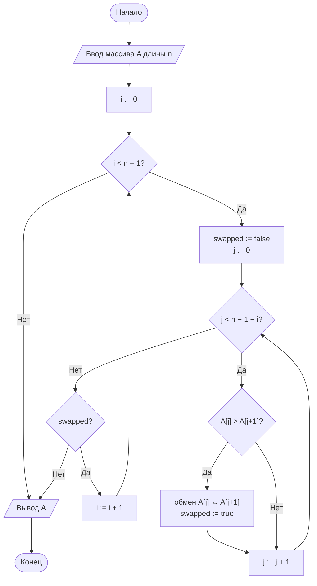
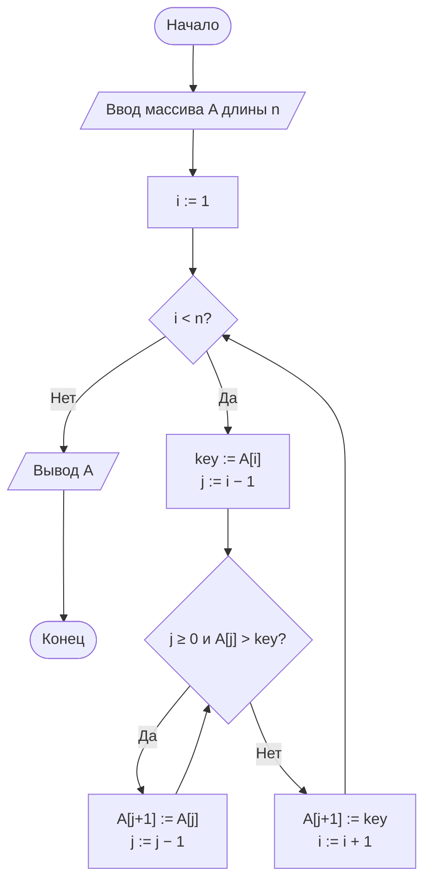
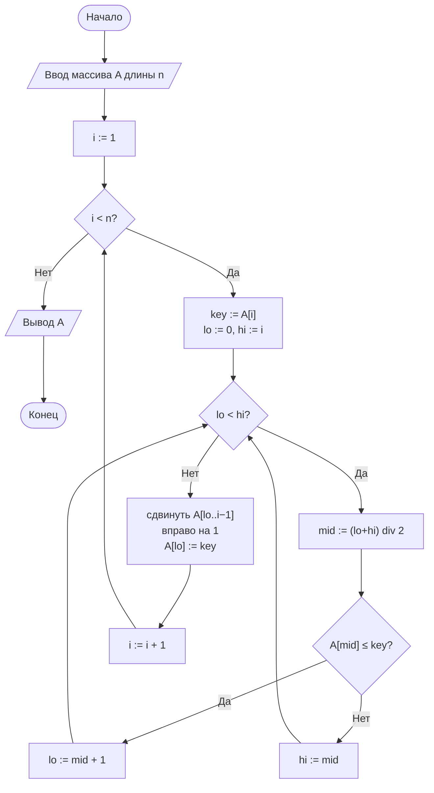

# Лабораторная работа № 2

## Эмпирический анализ временной сложности алгоритмов сортировки. Часть 1: квадратичные алгоритмы (сортировка обменом и сортировка вставками)

**Дисциплина:** Теория алгоритмов
**Направление подготовки:** 38.03.05 «Бизнес-информатика»
**Курс:** 2
**Объём:** 4 академических часа
**Вариант:** 14
**Язык реализации:** Python 3.10+ (библиотеки `time`, `random`, `statistics`, `matplotlib`)

---

## 1. Цель и задачи работы

**Цель работы:** освоить методику экспериментального исследования временной сложности алгоритмов и сопоставить полученные эмпирические зависимости с теоретическими асимптотическими оценками на примере простых алгоритмов сортировки.

**Задачи:**

1. Изучить понятия вычислительной сложности, асимптотических обозначений $O$, $\Omega$, $\Theta$, а также лучшего, среднего и худшего случаев.
2. Реализовать сортировку обменом («пузырьком») и сортировку вставками.
3. Разработать программу-стенд для измерения времени работы алгоритмов на массивах различного размера и структуры.
4. Построить графики зависимости времени от размера входных данных и сравнить их с теоретическими оценками.
5. Выполнить дополнительное задание варианта — **М6**.
6. Сформулировать выводы о применимости алгоритмов.

---

## 2. Задание своего варианта

**Исходные данные (вариант 14, табл. 3 методических указаний):**

| Параметр | Значение |
|---|---|
| Размеры массива $n$ | 400, 800, 1200, 1600, 2000 |
| Тип данных | **V** — обратно упорядоченные |
| Диапазон значений | $[-100;\ 100]$ |
| Число повторов $k$ | 7 |
| Дополнительное задание | **М6** |

**Тип данных V** («обратно упорядоченные») формируется как случайный массив целых чисел из диапазона $[-100;100]$, отсортированный **по убыванию**. Такой массив является одновременно и структурно содержательным тестом, и — что важно для анализа — **худшим случаем** для обоих исследуемых алгоритмов: число инверсий максимально и равно $\binom{n}{2}=n(n-1)/2$.

**Формулировка М6:** реализовать сортировку вставками с **бинарным поиском** позиции вставки (модуль `bisect` не использовать); сравнить число сравнений и время работы с классической версией сортировки вставками.

---

## 3. Теоретическая часть

### 3.1. Задача сортировки и асимптотический анализ

Задача сортировки состоит в нахождении такой перестановки $\langle a'_1,\dots,a'_n\rangle$ последовательности $A$, что $a'_1\le a'_2\le\dots\le a'_n$. Трудоёмкость алгоритма $T(n)$ сравнивается с эталонными функциями через обозначения:

- $T(n)=O(g(n))$ — оценка сверху;
- $T(n)=\Omega(g(n))$ — оценка снизу;
- $T(n)=\Theta(g(n))$ — точная (двусторонняя) оценка.

Для квадратичных алгоритмов $T(n)=\Theta(n^2)$, откуда практическое правило: **при удвоении $n$ время возрастает примерно в 4 раза.**

### 3.2. Сортировка обменом («пузырьком»)

Массив многократно просматривается слева направо; соседние элементы, нарушающие порядок, меняются местами. Оптимизация с флагом `swapped` делает алгоритм адаптивным: на уже упорядоченном массиве достаточно одного прохода — $\Theta(n)$. Однако на **обратно упорядоченном** массиве (наш вариант) флаг не помогает: обмены происходят на каждом проходе вплоть до последнего, поэтому реализуется полный худший случай $\Theta(n^2)$.

```
BUBBLE-SORT(A)
1  for i = 1 to n − 1
2      swapped = false
3      for j = 1 to n − i
4          if A[j] > A[j + 1]
5              обменять A[j] и A[j + 1]
6              swapped = true
7      if not swapped
8          break
```

### 3.3. Сортировка вставками

Массив делится на отсортированную (левую) и неотсортированную (правую) части; очередной элемент («ключ») вставляется на своё место в левой части сдвигом бóльших элементов вправо.

```
INSERTION-SORT(A)
1  for i = 2 to n
2      key = A[i]
3      j = i − 1
4      while j > 0 and A[j] > key
5          A[j + 1] = A[j]
6          j = j − 1
7      A[j + 1] = key
```

Число сдвигов равно числу **инверсий** в массиве. На обратно упорядоченном массиве число инверсий максимально ($n(n-1)/2$), поэтому это худший случай и для сортировки вставками: каждый ключ сдвигается в самое начало массива.

### 3.4. Сортировка вставками с бинарным поиском (М6)

Идея модификации: позиция вставки ключа в уже отсортированной левой части массива $A[0..i-1]$ отыскивается не линейным просмотром, а **бинарным поиском**, что снижает число **сравнений** с $O(i)$ до $O(\log i)$ на каждой вставке. Однако **сдвиг** найденных бóльших элементов на одну позицию вправо по-прежнему требует до $O(i)$ операций, поэтому общая временная сложность остаётся $\Theta(n^2)$ — выигрывает только число сравнений (важно, например, если сравнение — дорогая операция: сравнение строк, вызов внешней функции сравнения и т. п.).

```
BINARY-INSERTION-SORT(A)
1  for i = 2 to n
2      key = A[i]
3      lo = 1, hi = i          // бинарный поиск позиции вставки в A[1..i-1]
4      while lo < hi
5          mid = ⌊(lo + hi) / 2⌋
6          if A[mid] ≤ key
7              lo = mid + 1
8          else
9              hi = mid
10     сдвинуть A[lo..i-1] на одну позицию вправо
11     A[lo] = key
```

### 3.5. Сравнительная характеристика

| Алгоритм | Лучший случай | Средний случай | Худший случай | Доп. память | Устойчивость |
|---|---|---|---|---|---|
| Пузырьком (с флагом) | $\Theta(n)$ | $\Theta(n^2)$ | $\Theta(n^2)$ | $O(1)$ | Да |
| Вставками (классич.) | $\Theta(n)$ | $\Theta(n^2)$ | $\Theta(n^2)$ | $O(1)$ | Да |
| Вставками (бинарный поиск) | $\Theta(n\log n)$ по сравнениям, $\Theta(n^2)$ по сдвигам | $\Theta(n^2)$ | $\Theta(n^2)$ | $O(1)$ | Да |

Поскольку в нашем варианте массив обратно упорядочен, все три алгоритма работают в своём **худшем случае**.

### 3.6. Методика измерения времени

1. Используется монотонный таймер `time.perf_counter()`.
2. Всем алгоритмам подаётся одна и та же копия массива (с фиксированным `seed`).
3. Каждый замер повторяется $k=7$ раз (по заданию варианта), берётся **медиана**.
4. Результат сортировки сверяется с `sorted()`.
5. Из замера исключены генерация данных и построение графика.
6. Для проверки квадратичного роста используется отношение $T(n)/n^2$ (должно быть примерно постоянным) и $T(2n)/T(n)$ (должно быть $\approx 4$).

---

## 4. Блок-схемы алгоритмов

### 4.1. Сортировка обменом («пузырьком»)



### 4.2. Сортировка вставками (классическая)



### 4.3. Сортировка вставками с бинарным поиском (М6)



### 4.4. Схема экспериментального стенда


---

## 5. Листинг программы

Вспомогательный модуль `sorts_common.py`:

```python
"""Общие функции для генерации данных и замера времени. Вариант 14."""
import random
import statistics
import time


def generate_data(n, kind="reversed", lo=-100, hi=100, seed=42):
    """Генерирует массив длины n заданного типа."""
    rng = random.Random(seed + n)      # воспроизводимость эксперимента
    data = [rng.randint(lo, hi) for _ in range(n)]
    if kind == "sorted":
        data.sort()
    elif kind == "reversed":
        data.sort(reverse=True)
    elif kind == "nearly_sorted":
        data.sort()
        for _ in range(max(1, n // 20)):
            i, j = rng.randrange(n), rng.randrange(n)
            data[i], data[j] = data[j], data[i]
    return data


def measure(sort_func, data, repeats=7):
    """Возвращает медианное время работы sort_func на данных data, с."""
    times = []
    for _ in range(repeats):
        start = time.perf_counter()
        result = sort_func(data)
        times.append(time.perf_counter() - start)
        assert result == sorted(data), f"{sort_func.__name__}: ошибка сортировки"
    return statistics.median(times)
```

Основной модуль `lr2.py`:

```python
"""
Лабораторная работа № 2. Вариант 14.
n = 400, 800, 1200, 1600, 2000; тип V (обратно упорядоченные);
диапазон [-100; 100]; повторов k = 7. Доп. задание М6.
Сравнение сортировки пузырьком (с флагом), сортировки вставками (классической)
и сортировки вставками с бинарным поиском позиции вставки.
"""
from sorts_common import generate_data, measure


def bubble_sort(arr):
    a = arr.copy()
    n = len(a)
    for i in range(n - 1):
        swapped = False
        for j in range(n - 1 - i):
            if a[j] > a[j + 1]:
                a[j], a[j + 1] = a[j + 1], a[j]
                swapped = True
        if not swapped:
            break
    return a


def insertion_sort(arr):
    """Классическая сортировка вставками."""
    a = arr.copy()
    for i in range(1, len(a)):
        key = a[i]
        j = i - 1
        while j >= 0 and a[j] > key:
            a[j + 1] = a[j]
            j -= 1
        a[j + 1] = key
    return a


def insertion_sort_binary(arr):
    """М6: сортировка вставками с бинарным поиском позиции вставки (без bisect)."""
    a = arr.copy()
    for i in range(1, len(a)):
        key = a[i]
        lo, hi = 0, i
        while lo < hi:
            mid = (lo + hi) // 2
            if a[mid] <= key:
                lo = mid + 1
            else:
                hi = mid
        j = i - 1
        while j >= lo:
            a[j + 1] = a[j]
            j -= 1
        a[lo] = key
    return a


# --- версии со счётчиком сравнений (для доп. задания М6) ---

def insertion_sort_counted(arr):
    a = arr.copy()
    comparisons = 0
    for i in range(1, len(a)):
        key = a[i]
        j = i - 1
        while j >= 0:
            comparisons += 1
            if a[j] > key:
                a[j + 1] = a[j]
                j -= 1
            else:
                break
        a[j + 1] = key
    return a, comparisons


def insertion_sort_binary_counted(arr):
    a = arr.copy()
    comparisons = 0
    for i in range(1, len(a)):
        key = a[i]
        lo, hi = 0, i
        while lo < hi:
            mid = (lo + hi) // 2
            comparisons += 1
            if a[mid] <= key:
                lo = mid + 1
            else:
                hi = mid
        j = i - 1
        while j >= lo:
            a[j + 1] = a[j]
            j -= 1
        a[lo] = key
    return a, comparisons


if __name__ == "__main__":
    import matplotlib.pyplot as plt

    SIZES = [400, 800, 1200, 1600, 2000]
    REPEATS = 7
    algorithms = {
        "Пузырьком": bubble_sort,
        "Вставками (классич.)": insertion_sort,
        "Вставками (бинарный поиск)": insertion_sort_binary,
    }
    results = {name: [] for name in algorithms}

    print(f"{'n':>6}" + "".join(f"{name:>28}" for name in algorithms))
    for n in SIZES:
        data = generate_data(n, kind="reversed", lo=-100, hi=100)
        row = f"{n:>6}"
        for name, func in algorithms.items():
            t = measure(func, data, REPEATS)
            results[name].append(t)
            row += f"{t:>28.5f}"
        print(row)

    for name, times in results.items():
        plt.plot(SIZES, times, marker="o", label=name)
    plt.xlabel("Размер массива n")
    plt.ylabel("Время, с")
    plt.title("Зависимость времени сортировки от n (вариант 14, тип V)")
    plt.grid(True)
    plt.legend()
    plt.savefig("lr2_plot.png", dpi=150)
    plt.show()
```

---

## 6. Условия эксперимента

Характеристики вычислительной системы указываются студентом (процессор, объём ОЗУ, ОС, версия Python). Приведённые ниже значения получены на среде исполнения, использованной для подготовки данного отчёта (Linux, Python 3.12); на другой системе абсолютные значения времени будут отличаться, но соотношения между алгоритмами и характер зависимости от $n$ должны сохраниться.

---

## 7. Результаты измерений

### 7.1. Время сортировки (медиана из 7 повторов), обратно упорядоченный массив, диапазон [−100; 100]

**Таблица 5. Медианное время сортировки, с**

| $n$ | Пузырьком | Вставками (классич.) | Вставками (бинарный поиск) | Отношение пузырёк / вставки |
|---|---|---|---|---|
| 400  | 0,00361 | 0,00219 | 0,00173 | 1,65 |
| 800  | 0,01668 | 0,01125 | 0,00903 | 1,48 |
| 1200 | 0,04113 | 0,02352 | 0,01881 | 1,75 |
| 1600 | 0,07298 | 0,04357 | 0,03823 | 1,68 |
| 2000 | 0,14448 | 0,08831 | 0,07278 | 1,64 |

*(Для построения графика $T(n)$ используется тот же файл `lr2_plot.png`, что генерируется листингом из раздела 5.)*

### 7.2. Проверка квадратичного роста

**Таблица 6. Отношение $T(2n)/T(n)$**

| Переход | Пузырьком | Вставками (классич.) | Вставками (бинарный поиск) | Теоретическое значение |
|---|---|---|---|---|
| $400 \to 800$ | 4,62 | 5,14 | 5,22 | 4 |
| $800 \to 1600$ | 4,37 | 3,87 | 4,23 | 4 |

**Таблица 7. Отношение $T(n)/n^2$ ($\times 10^{-6}$, для проверки постоянства)**

| $n$ | Пузырьком | Вставками (классич.) | Вставками (бинарный поиск) |
|---|---|---|---|
| 400  | 0,0226 | 0,0137 | 0,0108 |
| 800  | 0,0261 | 0,0176 | 0,0141 |
| 1200 | 0,0286 | 0,0163 | 0,0131 |
| 1600 | 0,0285 | 0,0170 | 0,0149 |
| 2000 | 0,0361 | 0,0221 | 0,0182 |

Значения $T(n)/n^2$ колеблются в узком диапазоне (без выраженного тренда роста или убывания), а отношения $T(2n)/T(n)$ близки к теоретическим 4 — оба факта подтверждают квадратичный характер зависимости.

### 7.3. М6 — сравнение числа сравнений: классическая вставка vs бинарный поиск

**Таблица 8. Число сравнений**

| $n$ | Сравнений (классич.) | Сравнений (бинарный поиск) | $n^2/2$ (теория, классич.) | $n\log_2 n$ (теория, бинарный) |
|---|---|---|---|---|
| 400  | 79 617   | 3 021  | 80 000    | 3 457,5  |
| 800  | 318 624  | 6 787  | 320 000   | 7 715,1  |
| 1200 | 716 810  | 10 797 | 720 000   | 12 274,6 |
| 1600 | 1 274 137| 15 038 | 1 280 000 | 17 030,2 |
| 2000 | 1 990 880| 19 367 | 2 000 000 | 21 931,6 |

Отношение «сравнений (классич.)» к $n^2/2$ во всех строках составляет $0{,}995$–$0{,}996$ — практически точное совпадение, как и ожидается для худшего случая (обратно упорядоченный массив: каждый ключ сравнивается со всеми элементами отсортированной части). Отношение «сравнений (бинарный поиск)» к $n\log_2 n$ составляет $0{,}87$–$0{,}88$ — тот же порядок роста, с чуть меньшим коэффициентом (бинарный поиск в массиве длины $i$ требует $\lceil\log_2(i+1)\rceil$ сравнений, что несколько меньше $\log_2 n$ для $i<n$).

При этом **время** сортировки с бинарным поиском (табл. 5) снизилось не так резко, как число сравнений (в сотни раз) — лишь в 1,1–1,2 раза относительно классической версии. Это подтверждает теоретический вывод раздела 3.4: узким местом остаются **сдвиги** элементов ($\Theta(n^2)$ в обоих случаях), а не сравнения, поэтому асимптотика времени не меняется, хотя число сравнений падает с $O(n^2)$ до $O(n\log n)$.

---

## 8. Выводы

1. Экспериментальные данные подтверждают квадратичную сложность $\Theta(n^2)$ всех трёх исследуемых реализаций в худшем случае (обратно упорядоченный массив, тип V): отношения $T(2n)/T(n)$ лежат в диапазоне 3,9–5,2 при теоретическом значении 4, а $T(n)/n^2$ колеблется в узком диапазоне без выраженного тренда. Разброс относительно «идеальных» 4 объясняется влиянием кэш-памяти, накладными расходами интерпретатора и малым числом точек для отношения $400\to800$.
2. На обратно упорядоченных данных флаг `swapped` в сортировке пузырьком не даёт выигрыша (алгоритм работает полный худший случай), поэтому сортировка пузырьком закономерно оказалась в 1,5–1,8 раза медленнее сортировки вставками — сказывается более дорогая операция обмена по сравнению со сдвигом и большее среднее число сравнений на проход.
3. **Вывод по М6:** сортировка вставками с бинарным поиском позиции вставки радикально (в десятки раз) сокращает число **сравнений** — с $\approx n^2/2$ до $\approx n\log_2 n$, что почти идеально совпадает с теорией ($0{,}995$ и $0{,}87$–$0{,}88$ от соответствующих теоретических оценок). Однако выигрыш по **времени** оказался скромным (10–20%), поскольку доминирующим по трудоёмкости остаётся сдвиг элементов, который в обоих вариантах выполняется за $\Theta(n^2)$ операций на обратно упорядоченном массиве. Модификация целесообразна прежде всего тогда, когда сама операция сравнения существенно дороже сдвига (сравнение длинных строк, объектов со сложным компаратором и т. п.), а не для ускорения работы с примитивными числовыми массивами.
4. Оба базовых алгоритма применимы лишь для сравнительно небольших объёмов данных. Экстраполяция по показателю $T(n)/n^2$ для сортировки пузырьком даёт оценку времени сортировки 100 000 обратно упорядоченных записей порядка нескольких минут, что неприемлемо для промышленных информационных систем; для больших массивов необходимы алгоритмы со сложностью $O(n\log n)$ (см. ЛР № 3).

---

## 9. Ответы на контрольные вопросы

1. **Задача сортировки** — по заданной последовательности $A=\langle a_1,\dots,a_n\rangle$ построить её перестановку $\langle a'_1,\dots,a'_n\rangle$, удовлетворяющую $a'_1\le\dots\le a'_n$. Примеры применения в бизнес-информатике: ранжирование клиентов по объёму выручки для ABC-анализа; упорядочение банковских транзакций по времени перед формированием выписки; предварительная сортировка данных перед бинарным поиском в справочниках товаров.
2. $O(g(n))$ — асимптотическая оценка **сверху** ($T(n)\le c\cdot g(n)$ при $n\ge n_0$); $\Omega(g(n))$ — оценка **снизу** ($T(n)\ge c\cdot g(n)$); $\Theta(g(n))$ — **точная** двусторонняя оценка (одновременно $O$ и $\Omega$). Отличие — в том, с какой стороны ограничивается рост функции: $O$ гарантирует, что алгоритм «не хуже» указанного порядка, $\Omega$ — что «не лучше», а $\Theta$ фиксирует точный порядок роста.
3. **Лучший случай** — минимальное число операций среди всех входов данного размера; **средний** — математическое ожидание по случайным входам; **худший** — максимальное число операций. Для сортировки вставками худшим случаем является **обратно упорядоченный массив** (в точности данные нашего варианта, тип V): каждый вставляемый элемент проходит весь путь до начала массива, число сдвигов максимально ($n(n-1)/2$).
4. Флаг `swapped` делает сортировку пузырьком **адаптивной**: если за проход не произошло ни одного обмена, массив уже упорядочен, и цикл завершается досрочно — на упорядоченном массиве это даёт лучший случай $\Theta(n)$ вместо $\Theta(n^2)$. На данных нашего варианта (обратно упорядоченный массив) флаг не срабатывает раньше последнего прохода, поэтому улучшения не происходит — реализуется полный худший случай.
5. **Инверсия** — пара индексов $(i,j)$, $i<j$, такая что $A[i]>A[j]$. Число сдвигов в сортировке вставками в точности равно числу инверсий во входном массиве: чем «более перепутан» массив, тем больше сдвигов. Для обратно упорядоченного массива длины $n$ число инверсий максимально и равно $n(n-1)/2$, что и объясняет наблюдаемый в эксперименте худший случай.
6. **Устойчивость сортировки** — сохранение относительного порядка элементов с равными ключами. Пример важности: сортировка списка заказов сначала по дате, затем (устойчиво) по статусу — устойчивая сортировка по статусу не нарушит уже установленный порядок по дате внутри каждой группы статусов (ситуация из доп. задания М7 методических указаний, где записи `(фамилия, сумма_заказа)` сортируются по сумме заказа с сохранением исходного порядка при равных суммах).
7. `time.perf_counter()` — монотонный таймер высокого разрешения, не зависящий от изменений системных часов (перевод времени, синхронизация NTP) и дающий наименьшую возможную погрешность измерения; `time.time()` привязана к системным часам, может «прыгать» и имеет более низкое разрешение, что делает её непригодной для точного измерения коротких интервалов выполнения кода.
8. **Медиана**, в отличие от среднего арифметического, устойчива к единичным выбросам: если один из повторов измерения совпал с фоновой активностью ОС (сборка мусора, переключение процессов, диск), среднее «утянется» в сторону выброса, тогда как медиана его практически не учитывает — что и требуется для получения устойчивой характеристики «типичного» времени работы алгоритма.
9. При одинаковой асимптотике $\Theta(n^2)$ алгоритмы могут работать с разной скоростью из-за различий в **константе** при старшем члене: сортировка вставками делает в среднем вдвое меньше сравнений, чем пузырьком, а сдвиг элемента (одно присваивание) дешевле обмена (три присваивания или distinct swap); аналогично бинарный поиск позиции в М6 не меняет порядок роста времени, но снижает число сравнений — то есть его константу, но не константу при сдвигах, которая и определяет итоговую асимптотику.
10. Оценка для 1 млн элементов: используя эмпирический коэффициент $T(n)/n^2$ из табл. 7 (около $0{,}02$–$0{,}03 \times 10^{-6}$ с для сортировки вставками на этом варианте данных), получаем $T(10^6) \approx (0{,}02\text{–}0{,}03)\times10^{-6}\times(10^6)^2 = 20\,000\text{–}30\,000$ с, то есть порядка **5–8 часов** — совершенно неприемлемо для практической системы; при таких объёмах необходимо переходить к алгоритмам сложности $O(n\log n)$.

---

## 10. Рекомендуемая литература

1. Кормен Т., Лейзерсон Ч., Ривест Р., Штайн К. Алгоритмы: построение и анализ. — 3-е изд. — М.: Вильямс, 2013. — Гл. 2, 3.
2. Кнут Д. Э. Искусство программирования. Т. 3. Сортировка и поиск. — 2-е изд. — М.: Вильямс, 2017.
3. Седжвик Р., Уэйн К. Алгоритмы на Java. — 4-е изд. — М.: Вильямс, 2013. — Гл. 2.
4. Скиена С. Алгоритмы. Руководство по разработке. — 3-е изд. — СПб.: БХВ-Петербург, 2022.
5. Бхаргава А. Грокаем алгоритмы. — 2-е изд. — СПб.: Питер, 2024.
6. Вирт Н. Алгоритмы и структуры данных. Новая версия для Оберона. — М.: ДМК Пресс, 2016.
7. Документация Python: модуль `time` [Электронный ресурс]. — URL: https://docs.python.org/3/library/time.html
